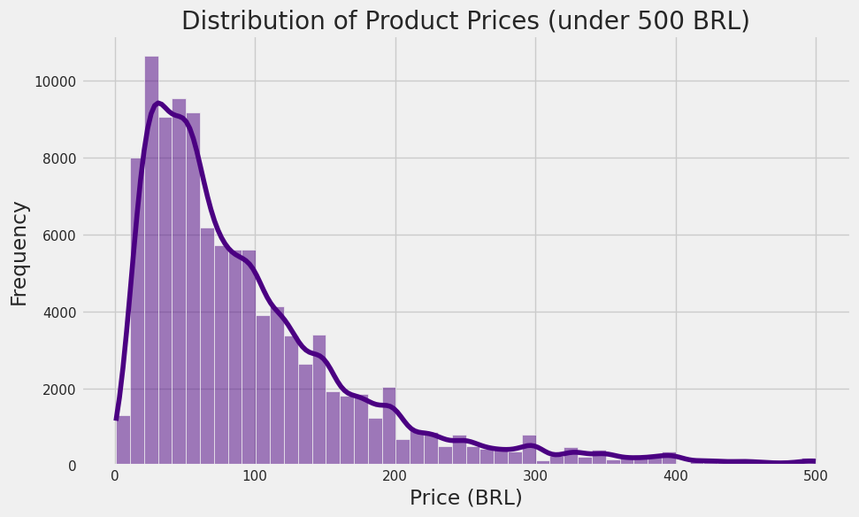
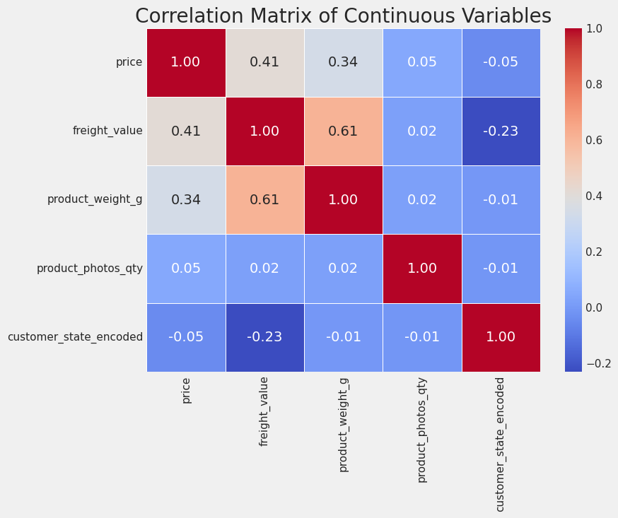

# Strategic E-Commerce Logistics & Revenue Analytics Report

##### Prepared By - W.A.R.P. Jayathilake (21020434)
###### [Github Repository](https://github.com/Raviyax/EcommerceLogisticsNRevenue) 

## 1. Introduction
Analysis of **110,163 orders** from Olist's Brazilian e-commerce platform reveals a critical inefficiency: **shipping costs consume 20–35% of purchase value**, acting as a primary conversion barrier. The median freight (16.26 BRL) on median purchase (74.90 BRL) represents **22% of transaction value**  a known abandonment trigger. Three strategic interventions can drive **15–25% revenue growth** within 12 months.

## 2. Data Selection & Analytical Process

This analysis uses the [Brazilian E-Commerce Public Dataset (Kaggle: Olist, 2016–2018)](https://www.kaggle.com/datasets/olistbr/brazilian-ecommerce), integrating Orders, Order Items, Customers, and Products tables through relational joins on customer and order IDs. The analytical process involved preprocessing (removing 3% incomplete records and label encoding categorical variables), exploratory data analysis with summary statistics and distribution analysis on 110,163 items, statistical analysis using Pearson correlation matrices on continuous variables, and K-Means clustering to identify customer behavioral segments. Data quality was maintained by removing missing values rather than imputing, preserving analysis integrity.

## 3. Exploratory Data Analysis & Findings

Analyzing 110,163 transactions, the median price is 74.90 BRL with mean of 119.97 BRL (std dev 182.24 BRL, range 0.85–6,735 BRL), while median freight is 16.26 BRL with mean of 19.95 BRL (std dev 15.70 BRL, range 0–409.68 BRL) and median weight is 700g with mean of 2,089.54g (std dev 3,741.38g, range 0–40,425g). The 60% gap between median and mean price indicates a right-skewed distribution where typical customers purchase under 100 BRL while luxury items distort the average upward. Most critically, median freight represents 22% of median purchase value, violating e-commerce best practices (industry standard: <15% for high conversion) and triggering cart abandonment among budget-conscious customers.

## 4. Statistical Analysis & Correlation Results

Weight and freight show strong correlation (0.61), indicating weight is the dominant cost driver with heavy goods facing exponential increases. Price and freight correlate at 0.41, meaning premium items cost more to ship and experience margin compression. Photo quantity has near-zero impact (0.02–0.05 correlation with price/weight), suggesting quality matters more than quantity. Geography shows negative correlation with freight (−0.23), revealing regional inefficiencies where remote states pay premiums. Overall, weight explains 37% of freight variance, making heavy goods like furniture and appliances face 25–35% higher relative costs, rendering them uncompetitive on the platform.

## 5. Strategic Recommendations

**Free Shipping Threshold** (High Impact, 30–60 days, 3–4 month ROI). The median freight at 22% of order value triggers cart abandonment. Implement free shipping on orders >150 BRL, 50% subsidy for 100–150 BRL, and standard rates <100 BRL. Expected outcomes: 8–12% conversion lift and AOV increase to 120+ BRL.

**Regional Fulfillment Hubs for Heavy Goods** (Medium-High Impact, 90–180 days, 6–12 month ROI). The weight-freight correlation creates structural disadvantage for furniture and appliances. Establish 3–5 fulfillment hubs (São Paulo, Rio, Belo Horizonte, Brasília, Salvador), partner with local logistics providers for volume discounts, and incentivize sellers to pre-position inventory through 2% revenue share. Expected outcomes: 25–35% freight cost reduction for heavy goods and 12–18% revenue uplift.

**Precision Customer Segmentation** (Medium Impact, 60–90 days, Low Difficulty). K-Means clustering identifies three segments: Red cluster (45 BRL AOV, 14 BRL freight, 55% customers) should receive bundle deals and free shipping >100 BRL; Green cluster (150 BRL AOV, 22 BRL freight, 30% customers) needs VIP loyalty and 5% rebates >200 BRL; Blue cluster (350+ BRL AOV, 35 BRL freight, 15% customers) requires concierge service and exclusive access. Expected outcomes: Red→Green conversion of 10–15%, email ROI of 3–5x, and churn reduction of 8–12%.

## 6. Conclusion

Olist operates a high-volume marketplace with a critical efficiency gap: **shipping friction constrains growth at conversion and retention stages.** The three recommendations  free shipping optimization, regional fulfillment, and customer segmentation  address distinct revenue levers with combined potential to drive **15–25% gross revenue growth** while improving customer lifetime value and reducing churn. Implementation timeline: 6–9 months for full rollout.
